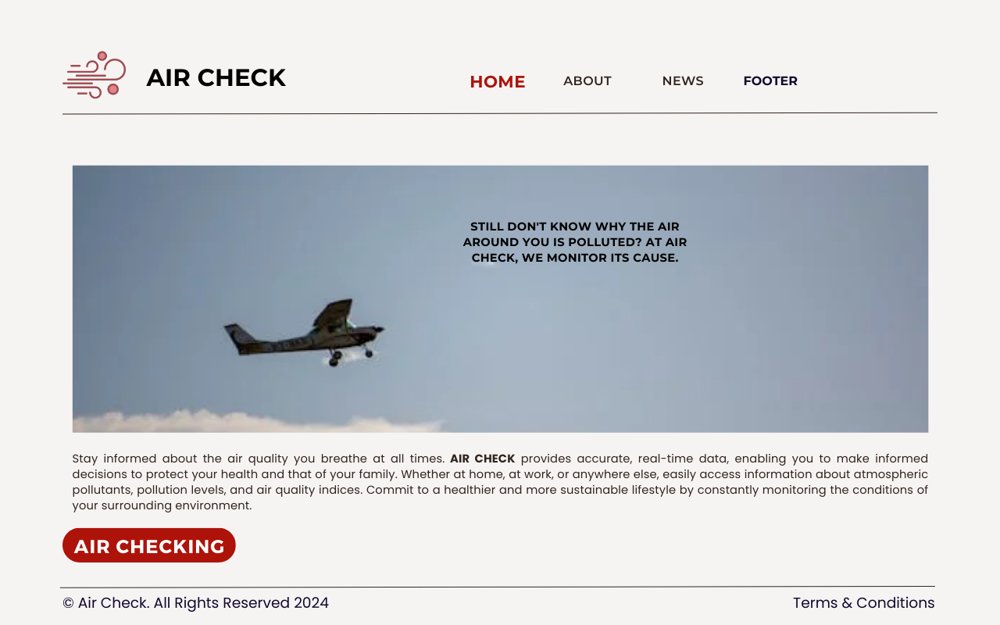
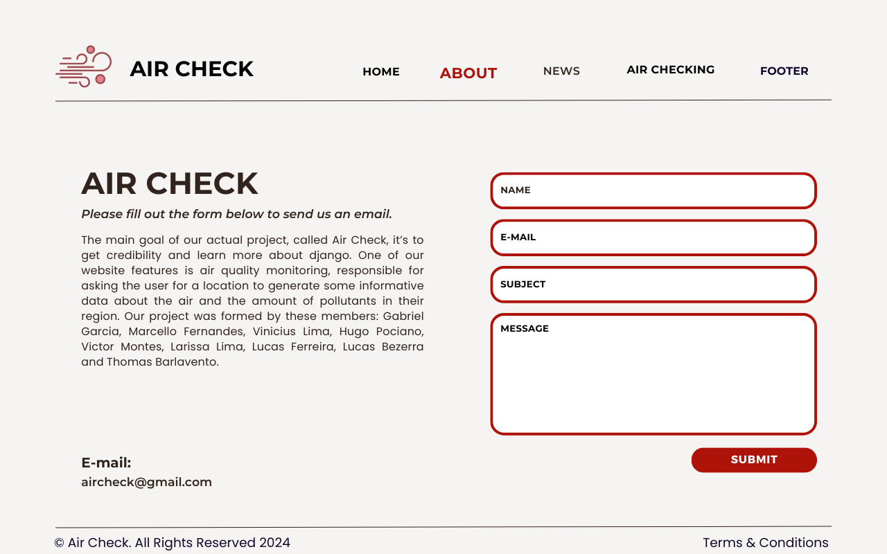
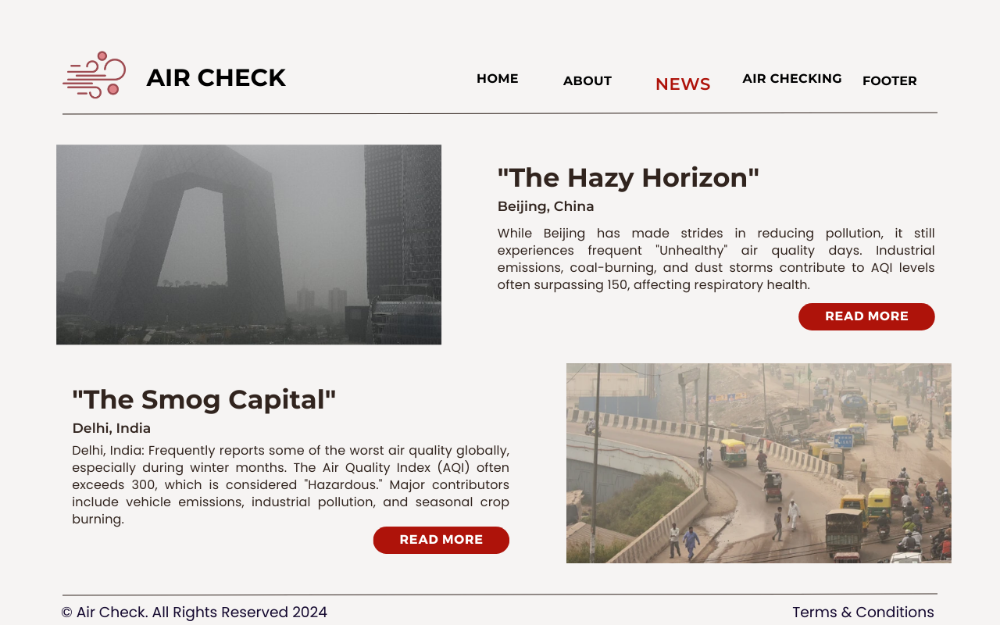
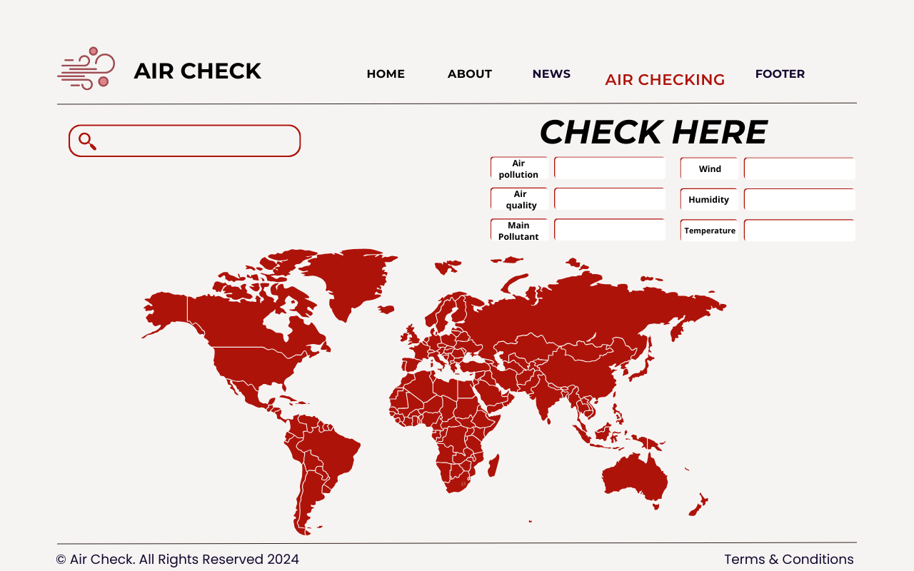
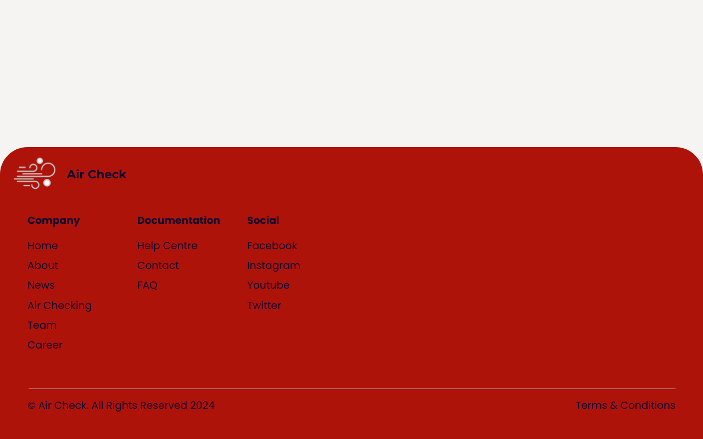

---

# Air Check Project

## Description

The **Air Check** project is an application for monitoring indoor air quality. It allows users to track pollutant levels, such as CO2, fine particles, and volatile organic compounds (VOCs), in real time. By using sensors installed in different rooms, the application displays graphs and alerts to ensure a healthy environment.

## Features

1. **Sketches**
   - [View Sketches](https://www.canva.com/design/DAGPdL1jPiE/yGPMJjDrRV9zdYg4t_7LGg/edit?utm_content=DAGPdL1jPiE&utm_campaign=designshare&utm_medium=link2&utm_source=sharebutton)

2. **Storyboards**
   - [View Storyboards](https://www.canva.com/design/DAGPbmRTUP8/Na02R1fYH_BTh3oBDriFkA/edit)

3. **Screenshots of the Board and Backlog (JIRA) in the README**
   - [View board screenshot](https://photos.google.com/share/AF1QipPZgEBV-bfVaTrheYdVAacwTxp-Vnxg1Gp6GgrLrAaY-7hY7buwf3Gw4fMGp703PA?key=VzFMbUVQNEJJX2FLZnJmZjB4WXBwaWswbk9rMzh3)
   - [View backlog screenshot](https://photos.google.com/share/AF1QipOwZwLRswJ_NlKKxuW-St5EbQo4-mAwp0rUM2s1s6NrFJ1fS899owJ_AdnTLNHzVw?key=dFIwcjBPbUpmUnU0VEV0bTk5QUhXVk51U3RSamJB)

4. **Air Check's screencast** 
   - [Screen cast](https://drive.google.com/file/d/17lv6vka524T4o-mk9uObwuvquenCncN7/view?pli=1)
   
## Screenshot

### Air Check Home

- **The image represents the home page of the “Air Check” application. On this screen, users will likely find summarized information about the app, such as a brief introduction, key features, and possibly a button to start monitoring air quality**.

### Air Check About

- **The image shows the “About” section of the app. Here, users can go into the purpose of the application, learn about the development team, explore the technologies used.**

### Air Check News

- **This part of the app displays news related to air quality. Users can see updates on pollution, regulatory changes, or tips for improving indoor air quality. It may include headlines, images, and links to full articles.**

### Air Check Checking

- **The “Checking” screen is where users directly interact with the app’s sensors. Here, they can view real-time data on air quality in different rooms, trend graphs, and receive alerts if levels deviate from recommended standards.**

### Air Check Footer

- **The footer is an essential part of the interface. It may contain links to other app sections, contact information, credits for the development team, or even links to project-related social media.**

